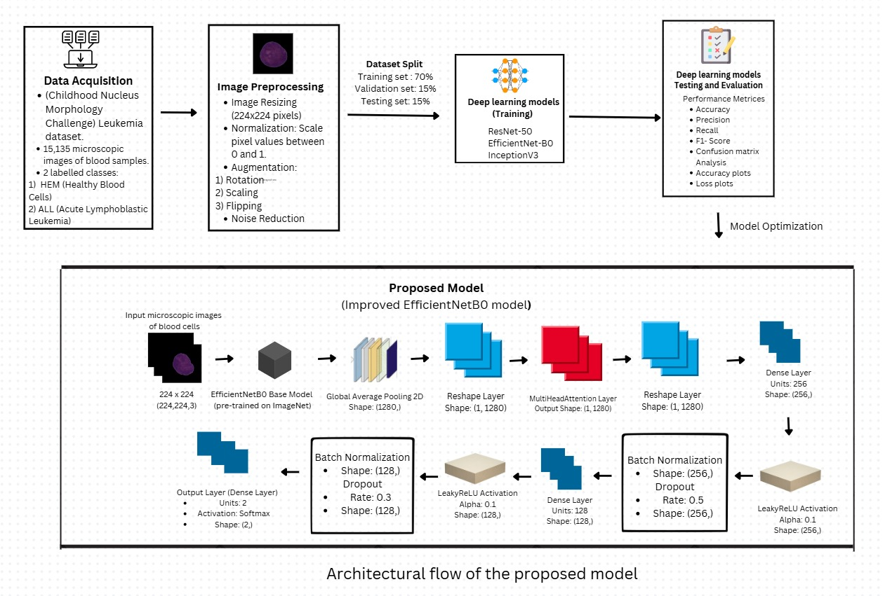

# Automated Leukemia Detection System  
An advanced deep learning project for **classifying leukemia** using microscopic blood cell images. This system differentiates between healthy cells (HEM) and leukemia (ALL) with **state-of-the-art accuracy** by leveraging innovative model enhancements and robust training techniques.  

---

## 🌟 Overview  
- Developed using **EfficientNet-B0**, **ResNet-50**, and **InceptionV3** models.  
- Enhanced with **multi-head attention**, **Leaky ReLU activation**, and **fine-tuning**, achieving an impressive **98.22% training accuracy** and **94.06% validation accuracy**.  
- Trained on the **C-NMC leukemia dataset**, featuring 15,135 labeled microscopic blood cell images.  

---

## 🚀 Features  
- **High Accuracy**: Outperformed traditional models with superior classification performance.  
- **Innovative Model Enhancements**: Fine-tuned EfficientNet-B0 with custom dense layers, batch normalization, and dropout layers.  
- **Stable Convergence**: Trained over **60 epochs**, ensuring consistent results and avoiding overfitting.  
- **Comprehensive Evaluation**: Validated using metrics like **precision, recall, F1-score**, and confusion matrix analysis.  

---

## 📂 Dataset  
- **Source**: [C-NMC Leukemia Dataset](https://www.kaggle.com/datasets/andrewmvd/leukemia-classification)  
- **Description**: 15,135 labeled blood cell images, categorized into:  
  - `hem`: Healthy cells (Hematological Malignancies)  
  - `all`: Leukemic cells (Acute Lymphoblastic Leukemia)  
- **Preprocessing**: Normalization, augmentation (rotation, zooming, shearing), and noise correction.

## 🖼️ Architecture  

Below is the architecture of the **Automated Leukemia Detection System**:

### Description:
- **Input**: Microscopic blood cell images.
- **Preprocessing**: Image normalization, augmentation, and noise correction.
- **Model**: **EfficientNet-B0**, **ResNet-50**, **InceptionV3** with multi-head attention.
- **Output**: Classified as **HEM** (healthy) or **ALL** (leukemia).

---

## ⚙️ Methodology  
1. **Preprocessing**  
   - Normalized image pixel values between 0 and 1.  
   - Augmented dataset with rotation, zoom, shearing, and flipping to increase model robustness.  

2. **Models Used**  
   - **EfficientNet-B0**: Enhanced with multi-head attention and custom dense layers.  
   - **ResNet-50**: Utilized for feature extraction through transfer learning.  
   - **InceptionV3**: Incorporated for multi-scale feature detection.  

3. **Training**  
   - Trained over **60 epochs** with Adam optimizer, reducing validation loss steadily.  
   - Fine-tuned layers to improve domain-specific feature extraction.  

4. **Evaluation**  
   - Precision, recall, F1-score, and confusion matrix analysis for comprehensive performance validation.  

---

## 📊 Results  
| Model            | Training Accuracy | Validation Accuracy |  
|-------------------|-------------------|---------------------|  
| ResNet-50        | 84.50%           | 87.49%             |  
| EfficientNet-B0  | 85.95%           | 86.49%             |  
| InceptionV3      | 81.06%           | 81.86%             |  
| **Proposed Model** | **98.22%**       | **94.06%**         |  

- The proposed model outperformed traditional architectures, achieving high accuracy and stable performance.  
- Confusion matrix analysis showcased robust classification with minimal misclassifications.  

---
## 📄 Report  

You can view the detailed project report here:  
[Automated Leukemia Detection Report](https://github.com/Jaffer74/Automated-Leukemia-Detection-and-Classification-Using-Deep-Learning-Techniques/blob/main/Automated%20Leukemia%20Detection%20System.pdf)

## 🔧 Requirements  
- Python 3.7+  
- TensorFlow 2.0+  
- Keras  
- NumPy  
- Pandas  
- Matplotlib  

## 🧠 Skills Demonstrated  
- **Deep Learning Frameworks**:  
  - TensorFlow  
  - Keras  

- **Model Development**:  
  - Transfer Learning  
  - EfficientNet-B0  
  - ResNet-50  
  - InceptionV3  

- **Data Preprocessing**:  
  - Image Normalization  
  - Data Augmentation (Rotation, Zooming, Shearing, Flipping)  
  - Noise Correction  

- **Model Evaluation**:  
  - Precision  
  - Recall  
  - F1-score  
  - Confusion Matrix Analysis
    
## 📬 Contact  
For any queries or collaboration opportunities, feel free to reach out to:  
- **Mohammed Jaffer Ali**  
- Email: [bl.en.u4cse21124@bl.students.amrita.edu](mailto:bl.en.u4cse21124@bl.students.amrita.edu)  
- GitHub: [https://github.com/Jaffer74](https://github.com/Jaffer74)  
- LinkedIn: [https://www.linkedin.com/in/mohammed-jaffer-ali-e0741/](https://www.linkedin.com/in/mohammed-jaffer-ali-e0741/)  

